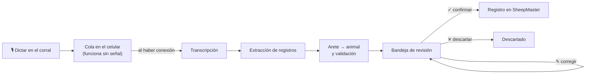
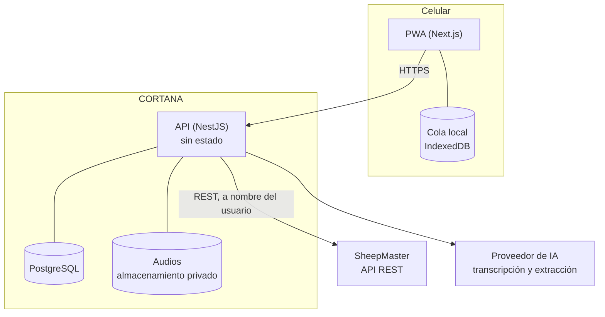

# CORTANA

**Captura por voz en el corral para [SheepMaster](https://danielhr3.github.io/Master_sheep/).**

El operador dice lo que hizo, por ejemplo *"la 245 pesó 38 y medio"*, y CORTANA lo convierte en un registro listo para SheepMaster. Graba aunque no haya señal, propone el registro y espera a que una persona lo confirme antes de escribir nada.

> **Estado: en diseño.** Este repositorio todavía no tiene código. Las funcionalidades de abajo son el alcance del MVP, no algo que ya funcione. La sección [Estado y ruta](#estado-y-ruta) dice qué falta y en qué orden.

---

## El problema

SheepMaster ya permite registrar pesajes, tratamientos y partos desde el celular. Pero esos hechos ocurren en el peor momento para teclear: con una mano en el animal, con guantes, bajo el sol y muchas veces sin señal. Lo habitual es anotarlo en una libreta y capturarlo después, o no capturarlo.

CORTANA cambia el teclado por la voz y deja la captura en manos de quien estuvo en el corral.

## Cómo funciona

1. **Dictas.** Mantienes presionado un botón grande y hablas. Al soltar, la nota queda guardada en el celular.
2. **Se sube sola.** Si no hay señal, la nota espera en cola y se envía cuando vuelve la conexión.
3. **Se entiende.** El audio se transcribe y de ese texto salen uno o varios registros estructurados.
4. **Se identifica al animal.** El arete dictado se busca, con coincidencia exacta, en el hato del rancho en SheepMaster.
5. **Se revisa.** El encargado ve cada registro propuesto con el animal identificado, la frase de la que salió y el audio, y lo confirma, corrige o descarta.
6. **Se aplica.** Al confirmar, el registro se escribe en SheepMaster a nombre de quien confirmó.

## Funcionalidades del MVP

### Captura en campo
- Botón de mantener presionado para grabar notas de hasta 60 segundos, con vibración al empezar y al terminar.
- **Funciona sin conexión:** las notas se guardan en el celular y sobreviven a cerrar la app o reiniciar el teléfono.
- Subida automática al recuperar la señal, en orden y sin duplicados.
- Estado visible de cada nota: en cola, subiendo, procesando, lista para revisar o con error.
- Instalable en el celular como aplicación (PWA), sin pasar por tiendas.

### Procesamiento
- Transcripción en español.
- **Cinco tipos de registro:** pesaje, tratamiento, parto, movimiento de corral y tarea.
- **Varios registros en una sola nota:** *"la 245 pesó 38, la 246 pesó 41 y la 250 pesó 36 y medio"* genera tres registros.
- Números hablados a decimales ("treinta y ocho y medio" → 38.5) y fechas relativas ("ayer", "el lunes") calculadas sobre el día de la grabación.
- Nombres de medicamentos y corrales reconocidos contra los catálogos del propio rancho.
- **Marcas de atención** cuando algo no cuadra: arete no encontrado o ambiguo, animal dado de baja, peso fuera de rango, fecha futura, dato faltante o posible duplicado.

### Revisión y aplicación
- Bandeja de registros pendientes, con filtros por tipo y por "requiere atención".
- Cada tarjeta muestra el animal identificado (arete, nombre, sexo y corral), los valores, la frase de origen y el audio.
- Edición de cualquier campo, del tipo de registro o del animal antes de confirmar.
- Confirmación de uno en uno o **en lote**, hasta 50 registros.
- Reintento seguro cuando SheepMaster no responde, sin crear registros duplicados.

### Trazabilidad
- Historial de registros aplicados y descartados con su línea de tiempo: quién dictó, qué se entendió, quién lo corrigió, quién lo confirmó y cuándo llegó a SheepMaster.
- Auditoría que no se puede editar ni borrar.
- Cada registro escrito en SheepMaster lleva la referencia a la nota de voz de la que salió.

### Acceso y privacidad
- Inicio de sesión con la misma cuenta de SheepMaster.
- Cada rancho solo ve sus propios datos.
- Los audios se borran 30 días después de cerrar sus registros; la transcripción y la auditoría se conservan.

## Principios de diseño

| Principio | Qué significa |
|---|---|
| **Nada se aplica sin una persona** | La voz propone, una persona decide. Ningún registro llega a SheepMaster sin confirmación. |
| **SheepMaster es la única fuente de verdad** | CORTANA no guarda una copia del hato. Lee catálogos y escribe por la API de SheepMaster. |
| **El modelo no elige al animal** | La IA convierte la frase en datos. Identificar el animal, validar rangos y marcar dudas lo hace código determinista. |
| **Mejor no extraer que inventar** | Cada registro debe citar la frase literal de la que salió. Si la cita no está en la transcripción, el registro se descarta. |
| **Grabar nunca depende de la red** | La señal solo hace falta para subir y procesar. |
| **Proveedor de IA intercambiable** | Transcripción y extracción se usan a través de interfaces; cambiar de proveedor no toca la lógica de negocio. |

## Qué no hace (a propósito)

- No responde con voz ni contesta preguntas sobre el hato.
- No da de alta animales nuevos: eso se sigue haciendo en SheepMaster.
- No tiene tableros propios: los reportes viven en SheepMaster.
- No aplica registros de forma automática. Se evaluará solo para pesajes y solo con datos de precisión reales del piloto.

## Arquitectura

| Capa | Tecnología |
|---|---|
| Frontend | Next.js (App Router), TypeScript, Tailwind CSS, shadcn/ui, TanStack Query, IndexedDB, MediaRecorder |
| Backend | NestJS, TypeScript estricto, Prisma, PostgreSQL, OpenAPI |
| IA | Transcripción y extracción estructurada detrás de puertos; proveedor por definir tras evaluarlo con audio real |
| Infraestructura | Contenedor sin estado, almacenamiento de objetos privado, GitHub Actions |
| Pruebas | Jest, Supertest, Playwright y una evaluación con un conjunto de frases reales grabadas en el corral |

El backend sigue arquitectura limpia: el dominio y los casos de uso no dependen del framework, del ORM ni de ningún SDK de proveedor.

## Estado y ruta

| Fase | Objetivo | Estado |
|---|---|---|
| **0. Validación** | Confirmar en el corral que el problema existe, grabar frases reales y verificar la API de SheepMaster | ⏳ Siguiente |
| **1. Primer pesaje por voz** | Un pesaje dictado llega a SheepMaster de punta a punta | Pendiente |
| **2. Sin conexión** | Grabar en modo avión y sincronizar sin pérdidas | Pendiente |
| **3. Todos los tipos** | Tratamiento, parto, movimiento y tarea; confirmación en lote | Pendiente |
| **4. Producción** | Historial, retención de audio, observabilidad y despliegue | Pendiente |
| **5. Prueba de campo** | Dos jornadas reales con métricas | Pendiente |

**Métricas que definen el éxito del piloto:** al menos 85 % de pesajes confirmados sin editar, cero registros aplicados al animal equivocado y cero notas de voz perdidas.

Si la Fase 0 muestra que el problema no existe tal como se describe, el proyecto se detiene ahí.

## Desarrollo

Todavía no hay código que instalar. Cuando exista, esta sección tendrá los comandos para levantar el entorno local con Docker Compose, correr las pruebas y desplegar.

## Documentación

La especificación completa (visión, historias de usuario con criterios de aceptación, modelo de dominio, contrato de API, pipeline de voz, seguridad y decisiones de arquitectura) se mantiene fuera de este repositorio.

---

Proyecto de [Daniel Hernández Rubio](https://danielhr3.github.io). Antes se llamaba JARVIS.
