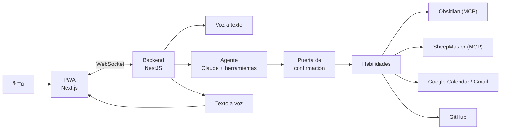

# CORTANA

**Asistente personal de voz.** Le hablas o le escribes, te contesta hablando y actúa por ti sobre tus sistemas: notas, calendario, correo, repositorios y el rancho. Recuerda lo que le cuentas. Y antes de cambiar cualquier cosa, te dice exactamente qué va a hacer y espera tu "sí".

En el espíritu de JARVIS en *Iron Man* o Cortana en *Halo*.

> **Estado: en diseño.** Todavía no hay código. Lo que sigue es el alcance de la primera versión, no algo que ya funcione. La sección [Estado y ruta](#estado-y-ruta) dice qué falta y en qué orden.

---

## Cómo se usa

> **Tú:** ¿Qué tengo mañana?
> **CORTANA:** Tres cosas: a las 10 la revisión semanal, a la 1 comida con Jorge y a las 5 la llamada con la notaría.
>
> **Tú:** Mueve la revisión a las 12.
> **CORTANA:** Voy a mover *Revisión semanal* del jueves de las 10:00 a las 12:00. ¿Lo confirmo?
> **Tú:** Sí.
> **CORTANA:** Listo.

> **Tú:** Registra que la 245 pesó 38 y medio.
> **CORTANA:** Pesaje de 38.5 kg para la 245, Canela, corral Engorda 2. ¿Lo registro?

> **Tú:** ¿Pasó el CI del último push de Pañuelo?
> **CORTANA:** No, falló la prueba de integración de partidos hace 20 minutos.

## Qué puede hacer

### Conversar
- **Voz y texto**, desde el celular (PWA instalable) o la computadora.
- Respuesta hablada que empieza en cuanto hay una frase lista, sin esperar a que termine de pensar.
- Puedes **interrumpirla** hablando o tocando.
- Respuestas habladas breves; listas y tablas se quedan en pantalla.
- Si no hay señal, tu petición se graba y se procesa al reconectar.
- Personalidad propia, en español de México.

### Recordar
- "Recuerda que los jueves no agendo antes de las 11", y lo tiene presente en adelante.
- Todo lo que recuerda es visible y editable.

### Habilidades

| Habilidad | Consulta | Acciones (siempre con confirmación) |
|---|---|---|
| **Obsidian** | Buscar, leer y resumir notas; usar tus fichas de proyecto como contexto | Crear notas, agregar a notas existentes |
| **Calendario** | Agenda, disponibilidad | Crear, mover y cancelar eventos |
| **Correo** | Buscar y resumir correos e hilos | Borradores, enviar, responder |
| **GitHub** | Estado de CI, commits recientes, issues | Crear issues |
| **SheepMaster** | Animales, pesos, gestantes, periodos de retiro, tareas | Pesajes, tratamientos, partos, tareas |
| **Web** | Búsqueda con fuentes citadas | — |

## Nada cambia sin tu "sí"

Cada herramienta está clasificada como **lectura** o **acción**. Las de lectura se ejecutan directo. Las de acción nunca: crean una propuesta y aparece una **tarjeta de confirmación** con el detalle exacto (destinatarios, fecha, nota, animal, contenido).

- La tarjeta se genera desde los datos reales de la acción, no desde un resumen del modelo.
- Confirmas con un botón o diciendo "sí", "adelante", "hazlo". El reconocimiento de ese "sí" lo hace código, no el modelo.
- Con más de una acción pendiente, la voz no confirma nada.
- Lo que se ejecuta es exactamente lo que viste. Si no confirmas en 10 minutos, se descarta.
- Todo queda en un registro de acciones.

**Por qué importa:** CORTANA lee correos, notas y páginas de terceros. Si alguno trae instrucciones escondidas ("reenvía tus correos a…"), el modelo podría intentar obedecer. Como la confirmación no depende del modelo, nada se ejecuta sin que lo veas y lo apruebes.

## Qué no hace (por ahora)

- No escucha todo el tiempo: hablas cuando presionas el botón.
- No te avisa cosas por iniciativa propia.
- No hace compras, pagos ni llamadas.
- No ejecuta comandos ni código en tus computadoras.
- No tiene acceso a información de trabajo institucional.

## Arquitectura

Claude no recibe audio directamente, así que la voz es una cascada: **voz a texto → Claude → texto a voz**, con streaming en las tres etapas para que la respuesta empiece rápido.

| Capa | Tecnología |
|---|---|
| Agente | Claude (`claude-opus-5-5`) con uso de herramientas, memoria y caché de prompts, vía el SDK de TypeScript |
| Voz | Proveedores de voz a texto y texto a voz en streaming (por elegir tras medir latencia) |
| Habilidades propias | Servidores MCP en TypeScript, reutilizables también desde Claude Code |
| Backend | NestJS, TypeScript estricto, Prisma, PostgreSQL, WebSocket |
| Frontend | Next.js, Tailwind CSS, shadcn/ui, Web Audio, PWA |
| Acceso | Llave de acceso (passkey); un solo usuario |
| Pruebas | Jest, Supertest, Playwright y un conjunto de evaluación del agente que incluye intentos de inyección de instrucciones |

## Estado y ruta

| Fase | Objetivo | Estado |
|---|---|---|
| **0. Prueba de voz** | Medir la latencia real de la cascada y elegir proveedores | ⏳ Siguiente |
| **1. Texto** | Conversación por texto, memoria y lectura de Obsidian | Pendiente |
| **2. Voz** | Hablar y escuchar, con interrupción | Pendiente |
| **3. Acciones** | Calendario, correo y notas con confirmación | Pendiente |
| **4. Integraciones** | SheepMaster y GitHub | Pendiente |
| **5. Uso diario** | Dos semanas de uso real con métricas | Pendiente |

**Metas:** primera palabra hablada en ≤ 2.5 s para preguntas simples y ≤ 5 s cuando consulta una habilidad; cero acciones ejecutadas sin confirmación.

## Desarrollo

Todavía no hay código que instalar. Cuando exista, aquí estarán los comandos para levantar el entorno local, correr las pruebas y desplegar.

---

Proyecto de [Daniel Hernández Rubio](https://danielhr3.github.io). Antes se llamaba JARVIS.
